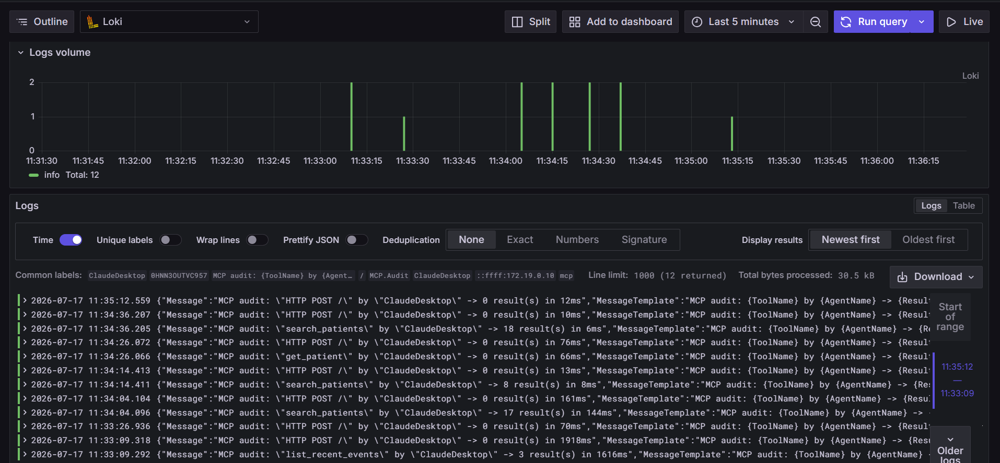
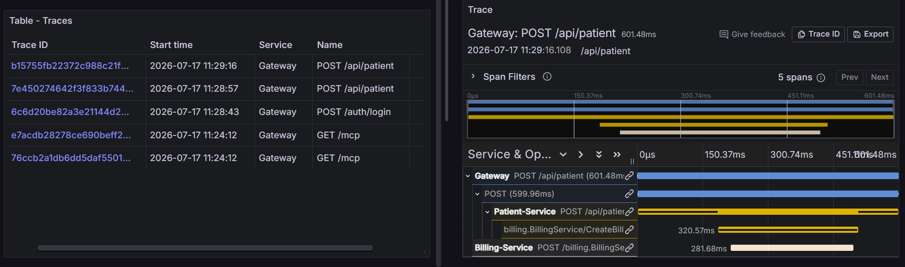
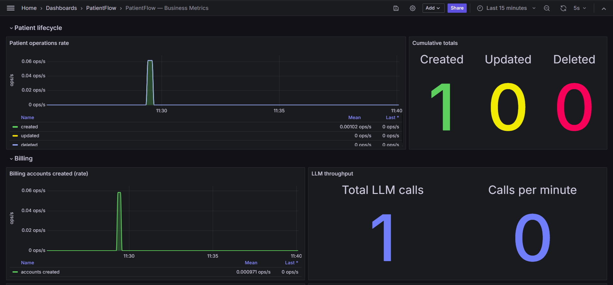
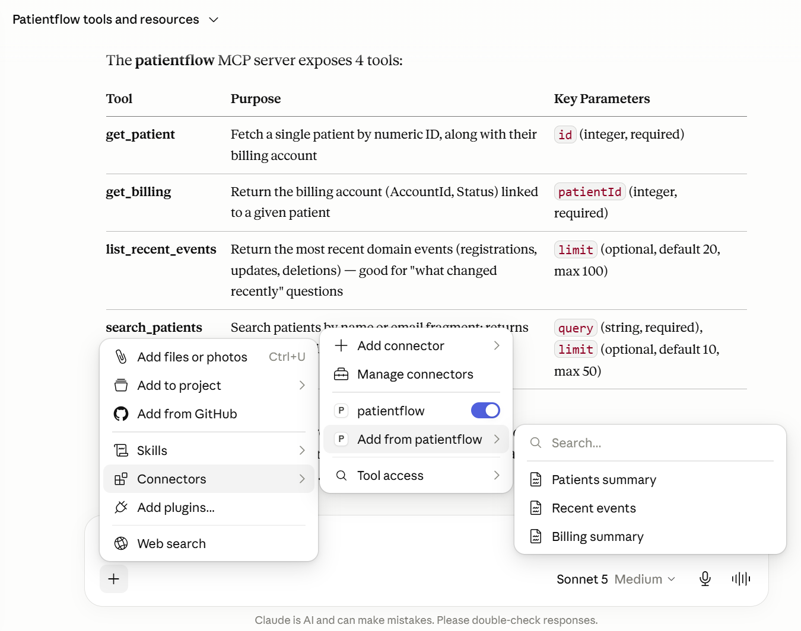
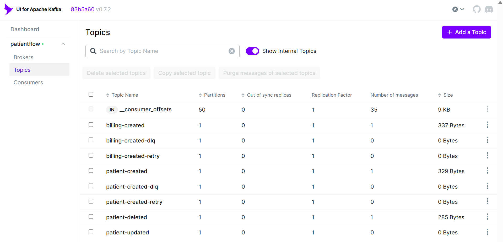

<h1 align="center">🏥 PatientFlow Enterprise Platform</h1>

<p align="center">
  <b>A production-shaped, HIPAA-aware healthcare microservices platform</b><br/>
  <sub>.NET 8 · Kafka · Postgres · Redis · pgvector · Ollama · YARP · OpenTelemetry · Loki · Tempo · Prometheus · Grafana · Kubernetes · MCP</sub>
</p>

<p align="center">
  
  
  
  
  
  
  
  
</p>

<p align="center">
  <a href="./ROADMAP.md"><b>📍 8-Phase Roadmap</b></a> ·
  <a href="./docs/phases"><b>📚 Phase Retrospectives</b></a> ·
  <a href="https://github.com/Aishwarya-K-R/PatientFlow-Platform"><b>🌱 v1 Prototype</b></a>
</p>

---

## 💡 Why this project

Most microservices demos stop at "three services and a REST call." **PatientFlow Enterprise Platform** is the opposite: it takes a fragile learning prototype and evolves it, one PR at a time, into a system that credibly simulates how a real healthcare platform would be built — with the security, reliability, observability, and AI integration that regulated production systems actually require.

Every phase is a **separate branch**, a **separate PR**, and a **tagged release**. You can `git checkout` any point in the 8-phase journey and see exactly what shipped when.

| What this project proves | How |
|---|---|
| I can design **event-driven microservices** that survive real failure modes | Outbox pattern, Kafka retry topics, DLQ, Polly circuit breakers, idempotent consumers |
| I understand **production observability** | OpenTelemetry traces (Tempo) + structured logs (Loki) + metrics (Prometheus) + dashboards-as-code (Grafana), all correlated via TraceId |
| I can build **AI features that respect PHI** | RAG with pgvector + local Ollama (no PHI leaves the trust boundary), prompt sanitiser, per-agent MCP API keys, dedicated audit channel |
| I ship like an engineer, not a demo-writer | Per-service DbContext, per-service Dockerfile, GitHub Actions CI/CD, Kubernetes manifests, phase-tagged releases, retrospectives per phase |

---

## 🎬 The headline feature — Phase 8: MCP + Audit

The latest phase makes PatientFlow's read side available to **any AI agent** (Claude Desktop, Claude Code, Copilot, custom bots) via the **Model Context Protocol** — with a full HIPAA-style audit trail.

```
┌─────────────────────┐   HTTP+SSE    ┌──────────────┐   /mcp/*      ┌───────────────┐
│  Claude Desktop     │ ────────────► │  YARP        │ ────────────► │  PMS.Mcp      │
│  (or any MCP agent) │  X-API-Key    │  Gateway     │ PathRemovePfx │  API-key auth │
└─────────────────────┘               └──────────────┘               │  4 tools      │
                                                                     │  3 resources  │
                                                                     └───────┬───────┘
                                                                             │ audit
                                                                             ▼
                                                                     Serilog(SourceContext=
                                                                            "MCP.Audit")
                                                                             │
                                                                             ▼
                                                                     Loki → Grafana
```

- **4 tools:** `search_patients`, `get_patient`, `get_billing`, `list_recent_events`
- **3 resources + 1 template:** `patients/summary`, `patients/{id}`, `billing/summary`, `events/recent`
- **Per-agent API keys** with `mcp:read` scope — every call attributable, individually revocable
- **Dual-layer audit:** transport middleware + tool-level `AuditLogger` — nothing escapes
- **Isolated audit channel:** same Loki instance, tagged `SourceContext=MCP.Audit`, queryable independently

Query it live in Grafana:
```logql
{service="mcp"} | json | SourceContext="MCP.Audit"
```

---

# 🏗️ Architecture

<p align="center">
  
</p>

> The diagram shows the v1 baseline. The current platform adds: **PMS.Mcp** service (MCP server + audit), **pgvector** for embeddings, in-cluster **Ollama**, **Tempo** for distributed tracing, **Loki** for structured logs, per-service **Outbox** tables, and **Kafka retry topics + DLQ**. See the [ROADMAP](./ROADMAP.md) for the full evolution.

---

## 🧱 Service map

| Service | Responsibility | Notable tech |
|---|---|---|
| **PMS.Gateway** | Single entry point, routing, rate limiting, `/mcp` path-rewrite | YARP |
| **PMS.Auth** | JWT-based RBAC, user management | ASP.NET Core Identity, own DbContext |
| **PMS.Patient** | Patient CRUD, event publishing, snapshot endpoint | EF Core, Outbox pattern, Kafka producer |
| **PMS.Billing** | Billing account lifecycle, event-driven creation & deletion | Kafka consumer, gRPC server, EF Core |
| **PMS.AI** | LLM + RAG chatbot, embedding pipeline, cache warmer | Ollama, pgvector, HNSW cosine index, Redis, Kafka consumer, PromptSanitizer |
| **PMS.Mcp** *(new)* | MCP server exposing read tools/resources with audit | ModelContextProtocol SDK 1.4.1, dual read-only DbContext, per-agent API keys |
| **PMS.Contracts** | Shared DTOs, protos, event envelopes | — |
| **PMS.Common** | Cross-cutting concerns: exception handling, health, logging | Serilog, health checks |

---

## 🔥 Feature highlights (grouped by phase)

<details>
<summary><b>Phase 1 — Foundation cleanup</b> · <code>v0.1-phase-0</code></summary>

- `.gitignore` + `.dockerignore`; **1869 build/runtime artefacts** removed from history
- Secrets extracted to `.env.example` and `Kubernetes/secrets.example.yml`
- Broken `GetPatientsSP` SQL replaced with **safe LINQ + column allow-list**
- `IPatientRepository` abstraction; service layer no longer touches `DbContext`
- `[Authorize(Roles=ADMIN)]` on `/ai/ask`; **pseudonymised patient names** sent to LLM
- Versioned Redis cache keys (cache-invalidation pattern)

📖 [Retrospective](./docs/phases/phase-0-foundation-cleanup.md)
</details>

<details>
<summary><b>Phase 2 — Real microservices split</b> · <code>v0.2-phase-1</code></summary>

- Single `PMS.csproj` → **`PatientFlow.sln` with 5 service + 2 shared library projects**
- Per-service `Program.cs`, `DbContext`, `Dockerfile`
- No more `if (serviceName == "X")` routing switch
- gRPC self-loop in Billing removed
- Namespace cleanup: `Patient_Management_System.*` → `PatientFlow.{Service}.*`

📖 [Retrospective](./docs/phases/phase-1-microservices-split.md)
</details>

<details>
<summary><b>Phase 3 — Data ownership + Outbox</b> · <code>v0.3-phase-2</code></summary>

- Per-service Postgres schemas: `patientflow_auth`, `patientflow_patient`, `patientflow_billing`
- **Outbox table per service** — events written transactionally with entity writes
- FluentValidation for request DTOs, unique indexes, EF migrations from SQL files
- `dotnet ef --idempotent` migration script generated for prod

📖 [Retrospective](./docs/phases/phase-2-data-ownership.md)
</details>

<details>
<summary><b>Phase 4 — Event-driven reliability</b> · <code>v0.4-phase-3</code></summary>

- **Event Envelope schema** — `EventId`, `EventType`, `Version`, `OccurredAt`, `Payload`, `Metadata`
- **Kafka producer hardening**: `Acks=All`, `EnableIdempotence=true`, `Flush` on shutdown
- **Manual offset commit** — `EnableAutoCommit=false`, commit only after successful processing
- **Retry topics + DLQ** with exponential backoff (2s, 4s, 8s), poison → DLQ after 3 attempts
- **Polly policies** — timeout → retry → circuit breaker for gRPC + HTTP
- Reusable `KafkaConsumerBase` powering all consumers

📖 [Retrospective](./docs/phases/phase-3-event-reliability-retrospective.md)
</details>

<details>
<summary><b>Phase 5 — Cache warming</b> · <code>v0.4.1-cache-warming</code></summary>

- `PatientCacheWarmer` — full snapshot from Patient DB → Redis on AI startup
- `GET /api/patients/all` snapshot endpoint (SYSTEM role only)
- Runtime updates via Kafka events keep cache fresh
- Hybrid pattern: **cache-warm at startup + event-driven invalidation at runtime** (Netflix / Facebook / Amazon shape)

</details>

<details>
<summary><b>Phase 6 — Observability</b> · <code>v0.5-phase-6</code></summary>

- **OpenTelemetry SDK** across all services with W3C TraceContext propagation
- OTLP exporter → **Tempo**; Grafana wired for trace navigation
- **Serilog** enriched with `TraceId`/`SpanId` → **Loki**
- Grafana dashboards-as-code (`observability/grafana/dashboards/*.json`)
- Prometheus alert rules + Alertmanager
- Business metrics: `patients_created_total`, `billing_failures_total`, `llm_request_latency_seconds`, cache hit ratio
- **Result:** click a slow gateway request → follow the trace through Patient → Kafka → Billing

</details>

<details>
<summary><b>Phase 7 — RAG with pgvector + Ollama</b> · <code>v0.6-phase-10</code></summary>

- **pgvector** extension on Postgres for patient embeddings
- Embedding pipeline on `PatientCreated`/`Updated`/`Deleted` events via Ollama (`nomic-embed-text`)
- Startup **embedding backfill** for pre-existing patients
- `AIController` performs **top-K vector search** instead of stuffing every patient into the prompt
- **HNSW cosine index** for fast semantic retrieval
- **Ollama in-cluster** as a Deployment (no `host.docker.internal` hack)
- **PromptSanitizer** defence against LLM prompt injection

</details>

<details open>
<summary><b>Phase 8 — MCP server + audit logging</b> · <code>v0.7-phase-11</code> · <b>🌟 latest</b></summary>

- New **PMS.Mcp** project using the official C# MCP SDK (`ModelContextProtocol` 1.4.1)
- Read-only `McpPatientDbContext` + `McpBillingDbContext` behind `McpReadRepository` (all queries `AsNoTracking`)
- **Per-agent API-key auth** with `mcp:read` policy — every call attributable, individually revocable
- **Tools:** `search_patients`, `get_patient`, `get_billing`, `list_recent_events`
- **Resources:** `patients/summary`, `patients/{id}` (template), `billing/summary`, `events/recent`
- **Audit channel:** dedicated Serilog `SourceContext=MCP.Audit`; `AuditEntry` + `AuditLogger` + `McpAuditMiddleware` guarantee no call (including auth failures + tool crashes) escapes the trail
- **Gateway integration:** `/mcp/{**catch-all}` YARP route with `PathRemovePrefix` so external clients hit one hostname while the MCP container keeps natural `/` and `/sse` endpoints
- **Containerised:** docker-compose + Kubernetes Deployment/Service, per-agent API keys via Secret, `/health` probes; CI publishes `aishwaryakr/mcp-service:latest`
- **Bonus fix:** `PatientDeletedConsumer` in Billing closes an orphan-row gap **discovered through the new `billing/summary` MCP resource**

</details>

---

## ⚡ Quick start

### Prerequisites
- Docker Desktop
- .NET 8 SDK (only if running tests locally)
- ~8 GB RAM available for containers

### 1. Clone & configure
```bash
git clone https://github.com/Aishwarya-K-R/PatientFlow-Enterprise-Platform.git
cd PatientFlow-Enterprise-Platform
cp .env.example .env    # fill in DB passwords, JWT secret, MCP API keys
```

### 2. Bring up the stack
```bash
docker-compose up --build
```

### 3. Explore
| What | URL |
|---|---|
| API Gateway | http://localhost:5000 |
| Health check | http://localhost:5000/health |
| AI chatbot (`POST /ai/ask`) | http://localhost:5000/ai/ask |
| MCP endpoint (for Claude Desktop et al.) | http://localhost:5000/mcp |
| Kafka UI | http://localhost:8082 |
| Prometheus | http://localhost:9090 |
| Grafana (admin/admin) | http://localhost:3000 |

### 4. Run tests
```bash
dotnet test PatientFlow.sln
```

---

## 🤖 Connect Claude Desktop to your MCP server

Add to `%APPDATA%\Claude\claude_desktop_config.json`:
```json
{
  "mcpServers": {
    "patientflow": {
      "url": "http://localhost:5000/mcp",
      "headers": { "X-API-Key": "your-claude-desktop-key-from-.env" }
    }
  }
}
```

Restart Claude Desktop. You should see **4 tools + 3 resources + 1 template** listed. Every call you make appears in Grafana within seconds:

```logql
{service="mcp"} | json | SourceContext="MCP.Audit"
```

---

## ☸️ Kubernetes deployment

```bash
# Copy and fill in the templates
cp Kubernetes/secrets.example.yml Kubernetes/secrets.yml
# edit Kubernetes/secrets.yml with real values

kubectl apply -f Kubernetes/
kubectl get pods -w
```

All services ship with:
- Readiness + liveness probes on `/health`
- Resource requests/limits
- ConfigMap-driven env
- Secret-driven credentials

Recommended: cloud K8s (AKS/EKS/GKE) or a beefy Minikube (`--memory=8192 --cpus=4`).

---

## 🔄 CI/CD

- **GitHub Actions** builds every service on push to `main`
- Multi-stage Dockerfiles, images pushed to Docker Hub as `aishwaryakr/{service}:latest`
- Per-phase branches → PRs → merge → **annotated tag** (`v0.X-phase-N`)

---

## 📊 In action

### 🔐 HIPAA-style audit trail in Grafana (Phase 8)

Every MCP tool call — successful or failed — lands in Loki under `SourceContext="MCP.Audit"`, isolated from operational logs but sharing the same query surface.

<p align="center">
  
</p>

### 🕸️ Distributed tracing across services (Phase 6)

One click on a slow request in Grafana → follow the trace end-to-end through gateway, services, Kafka, and downstreams. TraceId + SpanId are stitched into every log line via OpenTelemetry + Serilog enrichment.

<p align="center">
  
</p>

### 📈 Custom business dashboards (Phase 6)

Dashboards-as-code checked into `observability/grafana/dashboards/` — request rate, latency percentiles, LLM latency, cache hit ratio, and business counters like `patients_created_total`.

<p align="center">
  
</p>

### 🤖 Claude Desktop consuming the MCP server (Phase 8)

After the config change, Claude Desktop discovers **4 tools + 3 resources + 1 template** exposed by `PMS.Mcp` and can query patient / billing / event data through the gateway using a scoped API key.

<p align="center">
  
</p>

### 📮 Kafka topology with retry topics + DLQ (Phase 4)

Hardened event pipeline: main topics for domain events (`patient-created`, `billing-created`, ...), retry topics for transient failures with exponential backoff, and dedicated DLQs for poison messages after 3 failed attempts.

<p align="center">
  
</p>

> 📸 **[More screenshots →](./docs/screenshots/)**

---

## 🧭 Repository map

```
PatientFlow.sln
├── src/
│   ├── PMS.Gateway/         YARP reverse proxy + /mcp path-rewrite
│   ├── PMS.Auth/            JWT/RBAC, own Postgres schema
│   ├── PMS.Patient/         CRUD + Outbox + Kafka producer
│   ├── PMS.Billing/         gRPC + Kafka consumer + orphan-cleanup
│   ├── PMS.AI/              LLM + RAG (pgvector) + cache warmer
│   ├── PMS.Mcp/             MCP server + audit (Phase 8)
│   ├── PMS.Contracts/       Shared DTOs, event envelopes, protos
│   └── PMS.Common/          Logging, health, exception handling
├── tests/                   Auth / Patient / Billing / AI test projects
├── Kubernetes/              Per-service Deployment + Service manifests
├── observability/           Prometheus rules + Grafana dashboards
├── docs/phases/             Per-phase retrospectives
├── docker-compose.yml
├── ROADMAP.md               8-phase story + tag mapping
└── README.md                (you are here)
```

---

## 📚 Further reading

- **[ROADMAP.md](./ROADMAP.md)** — the 8-phase evolution with the git-tag mapping table and "deliberately out of scope" section
- **[docs/phases/](./docs/phases/)** — per-phase retrospectives (what went well, what didn't, what I'd do differently)
- **[v1 prototype repo](https://github.com/Aishwarya-K-R/PatientFlow-Platform)** — where the story started

---

## 📜 License

MIT — see [LICENSE](./LICENSE).

---

<p align="center">
  <sub>Built by <a href="https://github.com/Aishwarya-K-R">@Aishwarya-K-R</a> · One phase, one PR, one tag at a time.</sub>
</p>

